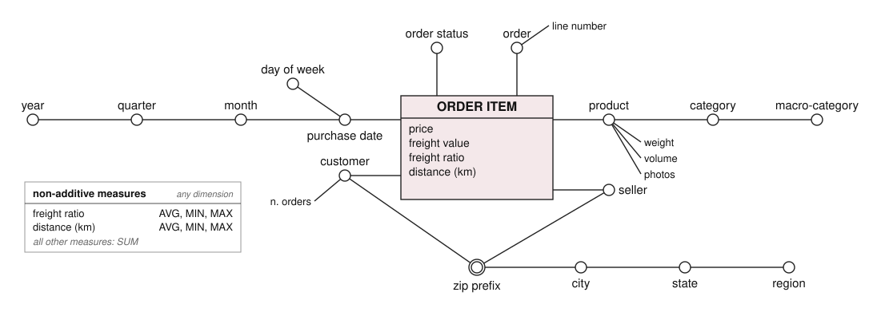
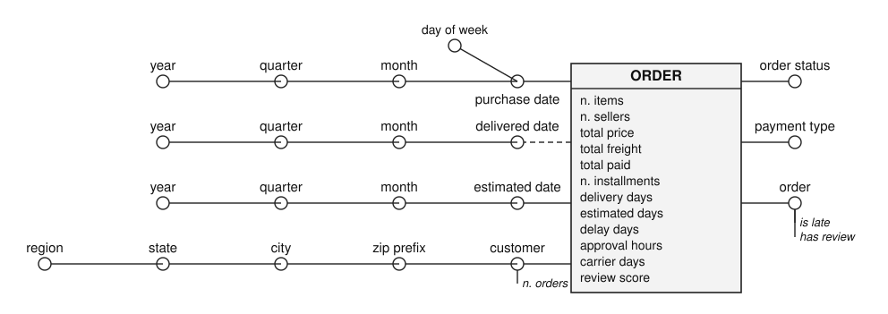
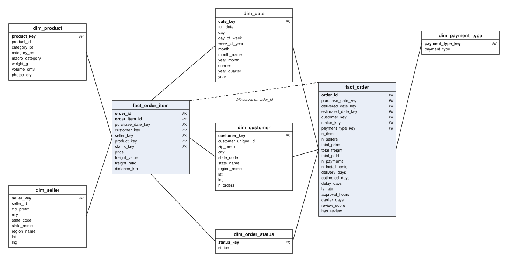

# Design notes

This document explains the modelling choices behind the warehouse: the grain of the facts, why there are two
of them, the dimensions and their hierarchies, the star-vs-snowflake decision, the additivity of the measures,
and how each data-quality problem of the source files is handled in the ETL.

## 1. Architecture: three layers in one PostgreSQL database

```
data/raw/*.csv  ──COPY──▶  staging.*  ──SQL──▶  reconciled.*  ──SQL──▶  dw.*  ──▶  OLAP sessions
 9 Kaggle files            9 tables,             12 tables,               6 dimensions,
                           all TEXT               typed & cleaned          2 facts, 2 mat. views
```

| layer | schema | what it is | files |
|---|---|---|---|
| sources | `data/raw/` | the nine Olist CSV files, untouched | `scripts/download_data.sh` |
| staging | `staging` | one table per file, every column `TEXT`, loaded with `COPY` | `scripts/load_staging.py` |
| reconciled | `reconciled` | typed, cleaned, deduplicated, integrated operational data | `sql/2*.sql` |
| data warehouse | `dw` | star schema: dimensions with denormalised hierarchies, two fact tables | `sql/30_*.sql`, `sql/40_*.sql` |
| physical optimisation | `dw` | two materialised views + indexes on foreign keys | `sql/50_*.sql` |

The reconciled layer is the integrated, quality-checked view of the operational data from which the
warehouse is loaded. Building it explicitly (instead of loading the star schema straight from the CSV files)
keeps every transformation visible and re-runnable, and separates *fixing the data* from *shaping it for
analysis*. All transformations are SQL: `CREATE TABLE … AS SELECT` statements that read the previous layer.
Python is used only to copy the CSV files into staging.

## 2. Sources and integration

Olist ships nine files linked by shared keys (`order_id`, `customer_id`, `product_id`, `seller_id`, zip code
prefixes). Two more sources are added in the reconciled layer:

* **IBGE macro-regions** — 27 states → 5 regions (`reconciled.region`). Gives the top level of both
  geographic hierarchies.
* **Macro-categories** — the 73 Olist product categories grouped into 12 (`reconciled.macro_category`).
  Olist's categories are too fine and inconsistent for roll-ups (`home_confort` and `home_comfort_2` are two
  different categories; `costruction_tools_garden` is a typo kept as-is). The grouping is ours and is documented
  in `sql/20_reconciled_lookups.sql`.

The translation file shipped by Olist is also completed: two categories used by products
(`pc_gamer`, `portateis_cozinha_e_preparadores_de_alimentos`) are missing from it.

## 3. Data-quality problems and how the ETL handles them

Profiling the raw files (DuckDB, before writing any ETL) found the following. Each row points to the SQL file
that solves it.

| # | problem in the source | numbers | solution | file |
|---|---|---|---|---|
| 1 | `customer_id` is generated per order; the person is `customer_unique_id` | 99,441 ids → 96,096 people; 2,997 repeat buyers | customer entity built on the person; address = most recent order; `customer_order_map` keeps the per-order key | `22` |
| 2 | `review_id` is not unique and orders have several reviews | 789 review ids on 2+ orders; 547 orders with 2+ reviews, 202 of them with different scores | the natural key of a review is the order: keep the most recent review per order | `27` |
| 3 | several payment rows per order (instalments, vouchers + card) | 2,879 orders with 2+ rows | aggregate per order: main type = highest value, `n_installments` = max, `total_paid` = sum | `26` |
| 4 | ~52 coordinate samples per zip prefix; 42 points outside Brazil; 8 prefixes under two states; city spelled in 3+ ways | 1,000,163 rows → 19,010 prefixes | bounding box, most frequent (state, city) per prefix, median lat/lng, `unaccent(lower(trim()))` | `21` |
| 5 | `seller_city` is free text with junk (`sbc/sp`, `04482255`, an e-mail address) | 3,095 sellers | city taken from the geolocation of the seller's zip prefix; cleaned text as fallback | `22` |
| 6 | products without category; categories without translation | 610 products; 2 categories | `unknown` category (its own macro-category); translation file completed | `20`, `23` |
| 7 | timestamps as text, some missing | 2,965 orders without delivery date (8 of them `delivered`) | typed with `NULLIF(…,'')::TIMESTAMP`; derived measures are NULL, rows are kept | `24` |
| 8 | 775 orders have no order lines (mostly `unavailable` / `canceled`) | 775 | kept in `fact_order` with `n_items = 0`; absent from `fact_order_item` by construction | `40` |
| 9 | 1,278 orders have lines from more than one seller | 1,278 | seller and distance are line-level; order-level analyses by seller use single-seller orders | `25`, `olap/04` |
| 10 | the time span is uneven: Sept–Dec 2016 and Sept–Oct 2018 are almost empty | 329 and 20 orders | not removed; time-series sessions restrict to comparable months and say so | `olap/03` |
| 11 | UTF-8 BOM at the start of the translation file | 1 file | stripped when reading the header | `load_staging.py` |
| 12 | typo in source column names (`product_name_lenght`) | — | renamed in the reconciled layer | `23` |

The delivery measures are derived once, in `24_reconciled_orders.sql`:
`delivery_days` = delivered − purchase, `estimated_days` = promised − purchase, `delay_days` = delivered − promised,
`is_late` = delivered *date* after the promised *date* (delivering on the promised day counts as on time —
comparing timestamps would flag 1,292 more orders as late because the promised date has no time of day).

## 4. Conceptual model (DFM)

Two facts, drawn in `docs/dfm/dfm_order_item.svg` and `docs/dfm/dfm_order.svg`.

### Fact ORDER ITEM — grain: one line of an order



* **Measures**: price, freight value, freight ratio (= freight / price), distance seller → customer (km).
* **Dimensions**: purchase date, customer, product, seller, order status, order (line number as descriptive attribute).

### Fact ORDER — grain: one order



* **Measures**: n. items, n. sellers, total price, total freight, total paid, n. payments, n. installments, delivery days,
  estimated days, delay days, approval hours, carrier days, review score (+ the flags is late, has review).
* **Dimensions**: purchase date, delivered date (optional: not every order is delivered), estimated date,
  customer, order status, payment type, order.

### Why two facts

Delivery time, delay and review score are properties of the **order**. Putting them on the order-line fact would
repeat them on every line of a multi-item order (9,803 orders have two or more lines): an average review by
product category would then weigh an order with three items three times, and a sum would be meaningless.
Keeping each measure at the grain where it exists is the standard answer; the two facts share the same
(conformed) dimensions — date, customer, order status — so they can be combined by drill-across on `order_id`
(session 04 does exactly that: seller and distance from the line fact, delivery from the order fact).

The alternative — one fact at line grain with order-level measures repeated and flagged as non-additive — was
rejected: it is harder to query correctly and the mistake is invisible in the results.

### Hierarchies

| dimension | hierarchy (finest → coarsest) | other attributes |
|---|---|---|
| date (×3 roles) | date → month → quarter → year; date → day of week | week of year, weekend flag |
| customer | customer → zip prefix → city → state → region | n. orders, coordinates |
| seller | seller → zip prefix → city → state → region | coordinates |
| product | product → category → macro-category | weight, volume, photos, name/description length |
| order status | status | |
| payment type | payment type | |

Date is a **role-playing dimension**: the same `dim_date` table is referenced three times by `fact_order`
(purchase, delivered, estimated). The delivered date is an **optional** arc (NULL when the order is not delivered).
In the DFM the date hierarchy is drawn once, from a double circle (shared hierarchy) reached by three arcs
labelled with their roles; the dash across the delivered arc marks it as optional. In ORDER ITEM, customer
and seller share the geographic hierarchy from the zip prefix up. Next to each fact, a box lists the
non-additive measures with the operators they allow (AVG, MIN, MAX); all the other measures are summed.

## 5. Logical model: star schema



The diagram is generated from the database catalog (`information_schema`, `pg_constraint`) by
`docs/dfm/draw_diagrams.py`: tables, columns, keys and row counts are read from the warehouse, with one line
per foreign key and the crow's foot on the many side. Only the position of the tables is fixed by hand.

Six dimension tables and two fact tables (`sql/30_dw_dimensions.sql`, `sql/40_dw_facts.sql`). Every
dimension has a surrogate integer key (`SERIAL`) and keeps the natural key of the source (`customer_unique_id`,
`seller_id`, `product_id`); `dim_date` uses the readable `yyyymmdd` integer as key. Facts reference dimensions
with declared foreign keys; each foreign key has a B-tree index.

### Star, not snowflake

The hierarchies are stored **denormalised**: `dim_customer` has zip prefix, city, state, state name and
region as columns of the same row; the same for `dim_seller` and `dim_product`. Reasons:

1. **Query simplicity** — every OLAP query joins a fact with its dimensions and groups by the level it needs;
   no chain of joins to reach "region".
2. **Size** — the dimensions are small (96k, 3k, 33k, 800 rows); the redundancy of repeating "Southeast" on
   66k customer rows costs a few hundred kB. A snowflake would save almost nothing.
3. **The hierarchies are strict** (each city is in one state, each state in one region, each category in
   one macro-category), so denormalising them creates no update anomaly in a load-once warehouse.

A snowflake would be the better choice if the geography were shared as a separate `dim_geography` table
between customers and sellers and updated independently, or if the dimensions were large. Neither applies.

### Degenerate dimension and replicated attribute

`order_id` is kept in both facts as a **degenerate dimension** (an identifier with no dimension table) — it is
what drill-across joins on. `status_key` appears in `fact_order_item` too, although order status is an order
attribute: it is a foreign key, not a measure, so replicating it causes no additivity problem and lets every
line-level query slice on "delivered orders" without a drill-across.

## 6. Additivity of the measures

| measure | additive over | comment |
|---|---|---|
| price, freight_value, total_price, total_freight, total_paid, n_items | all dimensions | sum freely |
| freight_ratio, distance_km, delivery_days, delay_days, estimated_days, approval_hours, carrier_days | none (use averages) | a sum of days over orders has no meaning; average or distribution |
| review_score | none | a judgement: average, share of 1-star / 5-star |
| is_late, has_review | counted | `avg(is_late::int)` = late rate |
| n_sellers, n_installments | none | counts per order; average, min, max across orders |

The OLAP files respect this: sums for money and counts, averages and shares for everything else.

## 7. Materialised views and quality checks

`sql/50_dw_materialized_views.sql` pre-aggregates the two most used cubes. They are a physical optimisation
and change nothing in the model; measured with `EXPLAIN ANALYZE`, the monthly sales cube goes from ~270–1,900 ms
on the fact table to ~4 ms on the view (see `docs/OLAP.md`). On a single month, as in the live demo
(`demo/02_explain_mv.sql`), the same question takes about 110 ms on the fact table and under 1 ms on the view.

`sql/60_quality_checks.sql` runs at the end of every rebuild and stops it if: a row count differs from the
source, the two facts disagree on total price or freight, `n_items` does not match the number of lines,
`is_late` contradicts `delay_days`, an order flagged `has_review` has no score, or `dim_date` has gaps.

## 8. Limits

* Coordinates are medians per zip *prefix* (5 digits), so `distance_km` is an approximation (±10–20 km in
  cities); 555 lines have no distance because one of the two prefixes is absent from the geolocation file.
* Revenue is the sum of item prices; freight is reported separately. `total_paid` (from payments) differs
  slightly from price + freight for a few orders (vouchers, rounding) and is kept as its own measure.
* The dataset is a sample of Olist's activity (2016–2018) with a partial first and last period; the time
  dimension covers 800 days but only 20 months are comparable across years.
